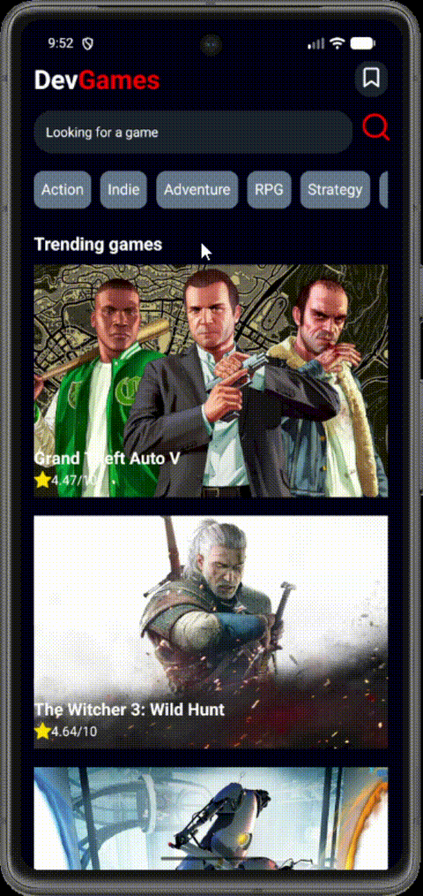

# 🎮 DevGames

Aplicativo mobile desenvolvido com **React Native** para explorar jogos, pesquisar títulos e visualizar informações detalhadas através da API da **RAWG**.

## ✨ Funcionalidades

* Listagem de jogos
* Filtro de jogos por categoria
* Busca de jogos pelo nome
* Visualização dos detalhes do jogo
* Informações sobre avaliação, lançamento, gêneros e plataformas
* Adição de jogos aos favoritos
* Tela de favoritos
* Exclusão de jogos dos favoritos
* Visualização da descrição completa através de modal
* Navegação entre telas

## 🛠️ Tecnologias

* React Native
* JavaScript
* React Navigation
* Styled Components
* Axios
* RAWG API

## 📱 Telas

* Home
* Busca
* Detalhes do jogo
* Favoritos

## 📱 Demonstração

Confira abaixo uma demonstração das principais funcionalidades do aplicativo:



O vídeo demonstra:

* Navegação pela tela inicial
* Filtro por categoria
* Busca de jogos
* Acesso aos detalhes de um jogo
* Adição de jogos aos favoritos
* Visualização dos favoritos
* Exclusão de um jogo dos favoritos
* Visualização da descrição completa através de modal

## 🚀 Como executar o projeto

Clone o repositório:

```bash
git clone https://github.com/viferreira-dev/devgames.git
```

Entre na pasta do projeto:

```bash
cd devgames
```

Instale as dependências:

```bash
npm install
```

Execute o projeto:

```bash
npx react-native run-android
```

## 📚 Aprendizados

Durante o desenvolvimento deste projeto, aprofundei conhecimentos em:

* Componentização
* Gerenciamento de estado
* Navegação entre telas
* Consumo de API
* Requisições com Axios
* Criação de interfaces com Styled Components
* Renderização de listas com FlatList
* Passagem de propriedades entre componentes
* Implementação de favoritos
* Utilização de modais
* Organização de código em React Native

## 👩‍💻 Desenvolvedora

**Vitoria Ferreira**

* GitHub: https://github.com/viferreira-dev
* LinkedIn: https://www.linkedin.com/in/vicode
